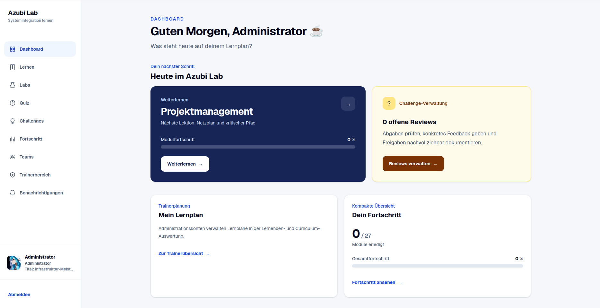
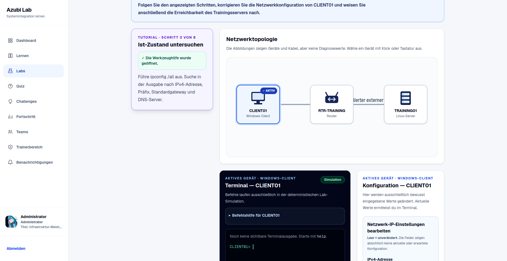
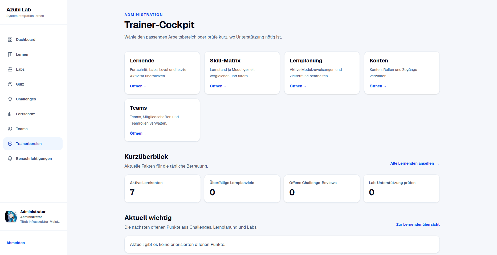
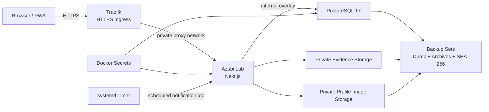

# Azubi Lab

**Self-hosted Lernplattform für Fachinformatiker Systemintegration – mit eigener Linux-, Container-, Datenbank-, Deployment- und Backup-Infrastruktur.**

Azubi Lab ist ein persönliches Praxisprojekt, das aus dem Wunsch entstanden ist, FISI-Lerninhalte, Übungen und praktische Troubleshooting-Szenarien an einem Ort zu bündeln.

Das Projekt besteht nicht nur aus der Webanwendung: Ich betreibe und entwickle auch die dazugehörige Self-Hosting- und Deployment-Struktur mit Linux, Docker/Swarm, PostgreSQL, Traefik, Bash-Automatisierung, Healthchecks, Migrationen, Backups und kontrollierten Restore-/Update-Abläufen.

### Einblick in die Anwendung




> **Portfolio-Hinweis**
>
> Dieses öffentliche Repository ist ein sanitisiertes Abbild eines real betriebenen Self-Hosted-Projekts. Produktionsdomains, Hostnamen, lokale Infrastrukturpfade, Secrets und die private Produktionshistorie sind nicht enthalten. Beispielwerte wie `azubi.example.com`, `swarm-manager` und `/srv/azubi-lab/...` sind bewusst neutralisiert.

## Was das Projekt zeigt

- Betrieb einer vollständigen Webanwendung auf Linux statt ausschließlich Frontend-Entwicklung
- Docker- und Docker-Swarm-Deployment mit privaten Overlay-Netzen
- Traefik als Reverse Proxy und TLS-Ingress
- PostgreSQL 17 mit versionierten und checksum-geprüften Migrationen
- Docker Secrets statt produktiver Klartext-Secrets in der Swarm-Konfiguration
- Bash-Automatisierung für Preflight, Migration, Backup, Restore und Administrations-Jobs
- unveränderliche Container-Images mit Commit-SHA-Tags
- Liveness-/Readiness-Healthchecks und Post-Deploy-Smoke-Tests
- konsistente Backups von Datenbank und privatem Dateispeicher
- Guarded Restore auf leere Ziele mit Prüfsummen- und Integritätskontrollen
- systemd-basierte Scheduler-Integration
- automatisierte Unit-, Integrations-, Datenbank- und Operations-Tests
- kontrollierter agentischer Entwicklungsworkflow mit Codex

## Anwendung

Azubi Lab richtet sich an die Ausbildung zum Fachinformatiker für Systemintegration.

Die Plattform umfasst unter anderem:

- Curriculum-Module und interaktive Lerninhalte
- Modulquizze und gemischte Practice-Quizze
- eine IHK-orientierte Prüfungssimulation ohne Anspruch auf offizielle IHK-Gewichtung
- interaktive Netzwerk- und Troubleshooting-Labs
- Lernfortschritt, XP, Level, Titel und Badges
- Lernpläne und Trainer-Reporting
- Challenges mit Reviews, Rubriken und privaten Nachweisdateien
- Teams und geschützte Social-Profile
- In-App-Benachrichtigungen und Web Push
- Administration und rollenbasierte Zugriffssteuerung

### Interaktive Labs



Die Labs bilden typische FISI-Szenarien als deterministische Simulationen ab.
Lernende untersuchen beispielsweise Netzwerkzustände über ein simuliertes
Terminal, korrigieren Konfigurationen und prüfen anschließend die Erreichbarkeit.

### Trainer- und Administrationsbereich



Trainer und Administratoren erhalten eigene Werkzeuge für Lernfortschritt,
Skill-Matrix, Lernplanung, Challenges, Teams und Kontenverwaltung.

Die aktuellen Rollen sind:

| Rolle | Zweck |
| --- | --- |
| `learner` | Lernen, Quizze, Labs, Challenges und eigener Fortschritt |
| `observer` | schreibgeschützte Produkt-/Profilansicht ohne Lernenden-XP |
| `instructor` | Lernplanung, Challenges, Reviews und Trainer-Reporting |
| `admin` | Konten, Rollen, Wiederherstellung und administrative Funktionen |

## Architektur



Im Swarm-Betrieb wird PostgreSQL ausschließlich an ein internes Overlay angebunden. App-Port 3000 und PostgreSQL-Port 5432 werden nicht direkt am Host veröffentlicht. Der Zugriff auf die Anwendung erfolgt über Traefik.

Private Uploads und Profilbilder liegen außerhalb des Webroots und werden nur über autorisierte Anwendungsrouten ausgeliefert.

## Tech Stack

| Bereich | Technologie |
| --- | --- |
| Runtime | Node.js 24 |
| Framework | Next.js 16.3.8 |
| UI | React 19, TypeScript, Tailwind CSS |
| Authentifizierung | Auth.js |
| Datenbank | PostgreSQL 17 |
| Container | Docker / Docker Compose |
| Orchestrierung | Docker Swarm |
| Reverse Proxy | Traefik |
| Automatisierung | Bash, systemd |
| Push | Web Push / VAPID |
| Lokale DB-Verifikation | rootless Podman oder Docker |
| Betrieb | self-hosted Linux |

## Operations und Deployment

Für Produktion existieren zwei dokumentierte Wege:

**`compose.production.yml`**

Portable Referenz für einen einzelnen Linux-Host mit Docker Compose bzw. kompatiblem Compose-Provider.

**`deploy/swarm-stack.yml`**

Sanitisierte Referenz des tatsächlich verwendeten Docker-Swarm-Ansatzes mit:

- internem PostgreSQL-Netz
- externem Traefik-Netz
- Docker Secrets
- festem Placement für zustandsbehaftete lokale Daten
- nicht privilegiertem App-Container
- `cap_drop: ALL`
- Liveness und Readiness
- explizit getaggten Images

Das ausführliche Betriebs- und Recovery-Konzept steht in [`docs/operations.md`](docs/operations.md).

## Backup und Recovery

Ein vollständiger Sicherungssatz besteht aus:

- PostgreSQL Custom-Format-Dump
- privatem Evidence-Archiv
- privatem Profilbild-Archiv
- Manifest mit SHA-256-Prüfsummen und Release-Kontext

Während eines konsistenten Backups werden Anwendungsschreibzugriffe bewusst gestoppt.

Restore erfolgt ausschließlich auf vorbereitete leere Ziele. Der Restore-Workflow prüft unter anderem Checksummen, Archivpfade und Zielzustand, bevor Daten übernommen werden.

Ein altes Container-Image wird ausdrücklich **nicht** als Datenbankschema-Rollback behandelt.

## Security-Entscheidungen

Produktive Secrets werden nicht im Repository oder in der Swarm-Umgebung als Klartext gepflegt. Kritische Werte werden als Docker Secrets bereitgestellt.

Weitere relevante Maßnahmen:

- PostgreSQL ohne öffentlichen Host-Port
- private Storage-Verzeichnisse mit restriktiven Rechten
- nicht privilegierter App-Benutzer
- keine Docker-Socket-Mounts im Anwendungscontainer
- serverseitige Capability-Prüfung für privilegierte Aktionen
- Sitzungsinvalidierung über `auth_version`
- einmalige, gehashte Passwort-Reset-Tokens
- persistente Rate-Limits für teure Authentifizierungspfade
- Dateityp-, MIME-, Größen- und Signaturprüfung für Nachweise
- zufällige interne Storage-Schlüssel
- SHA-256-Integritätsmetadaten
- sichere Response-Header und private Cache-Regeln

## Validierung

Das Repository enthält eine eigene Validierungs-Toolchain.

```bash
npm run codex:preflight
npm run verify:focused -- <profile>
npm run verify:db -- <suite>
npm run verify:full
npm run codex:report
```

`verify:full` bündelt unter anderem:

- Shell-Syntaxprüfung des Toolkits
- Toolkit-Selbsttest
- Anwendungstests
- ESLint
- TypeScript
- Operations-Syntaxprüfung
- Production Build
- `git diff --check`

Datenbanktests verwenden eine **wegwerfbare PostgreSQL-17-Instanz** über rootless Podman oder direkt nutzbares Docker. Produktionsdatenbanken und Produktionszugangsdaten werden dabei nicht verwendet.

## Agentischer Entwicklungsworkflow

Codex wird in diesem Projekt als kontrolliertes Implementierungswerkzeug eingesetzt, nicht als Produktionsoperator.

Feature-Arbeit erfolgt in begrenzten Batches mit:

1. exaktem Git-Preflight und erwartetem Ausgangs-SHA,
2. fokussierten Tests während der Implementierung,
3. isolierten PostgreSQL-Integrationstests bei Persistenzänderungen,
4. Browser-UAT für betroffene Workflows,
5. vollständiger Validierung vor Abschluss,
6. anschließender menschlicher Prüfung.

Der Repository-Workflow untersagt Codex im normalen Entwicklungsablauf ausdrücklich, selbstständig zu committen, zu pushen, zu deployen oder auf Produktion zuzugreifen.

Details:

- [`docs/CODEX_WORKFLOW.md`](docs/CODEX_WORKFLOW.md)
- [`docs/CODEX_CONTEXT.md`](docs/CODEX_CONTEXT.md)

## Lokal starten

Voraussetzungen:

- Node.js 24
- npm
- PostgreSQL

```bash
nvm use
npm ci
cp .env.example .env.local

# lokale Werte in .env.local konfigurieren

npm run db:migrate
npm run db:seed

# optional erstes Administrationskonto
npm run db:seed-admin

npm run dev
```

Danach läuft die Entwicklungsinstanz unter:

```text
http://localhost:3000
```

Es gibt bewusst keine öffentliche Selbstregistrierung und keine Standard-Zugangsdaten.

## Repository-Struktur

```text
src/app/                 Next.js-Anwendung und Domänenlogik
db/migrations/           versionierte SQL-Migrationen
tests/                   Unit-/Domain-/Regressionstests
scripts/test-*.mts       Datenbank- und Action-Integrationstests
scripts/ops/             Backup-, Restore-, Migration- und Swarm-Operationen
scripts/codex/           Repository-lokale Validierungs-Toolchain
deploy/                  Swarm- und systemd-Beispiele
docs/operations.md       Betriebs-, Backup- und Recovery-Runbook
docs/CODEX_*.md          kontrollierter agentischer Entwicklungsworkflow
```

## Öffentliche Repository-Version

Diese Version ist für technische Einsicht und Portfolio-Zwecke bestimmt.

Insbesondere wurden gegenüber der privaten Betriebsumgebung neutralisiert oder nicht übernommen:

- reale Domains und Hostnamen
- interne IP-/Netzwerkdetails
- produktive Hostpfade
- Secrets und lokale `.env`-Dateien
- Backups und Nutzerdaten
- die private Git-Historie des Produktivprojekts

Die technische Architektur, Anwendung, Tests und Operations-Logik entsprechen dem realen Projektstand, soweit sie ohne unnötige Offenlegung der privaten Infrastruktur veröffentlicht werden können.

## Lizenz

Dieses Repository enthält derzeit **keine Open-Source-Lizenz**.

Der Quellcode ist öffentlich einsehbar, daraus wird jedoch keine allgemeine Erlaubnis zur Nutzung, Veränderung oder Weiterverbreitung abgeleitet.
